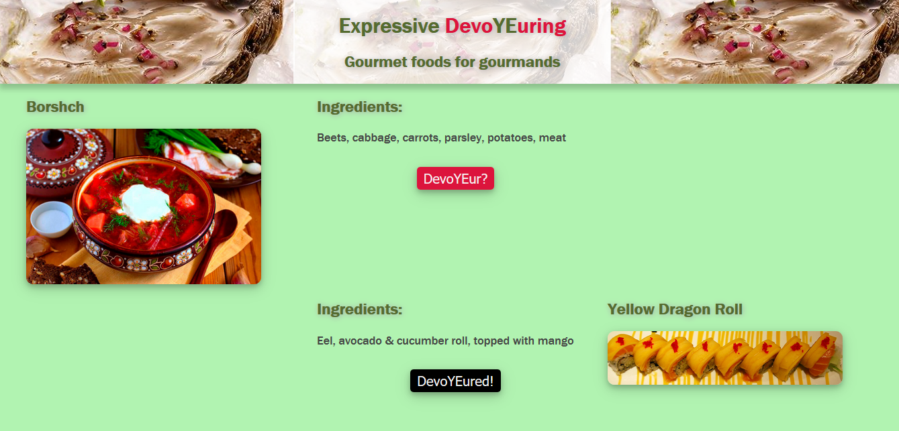
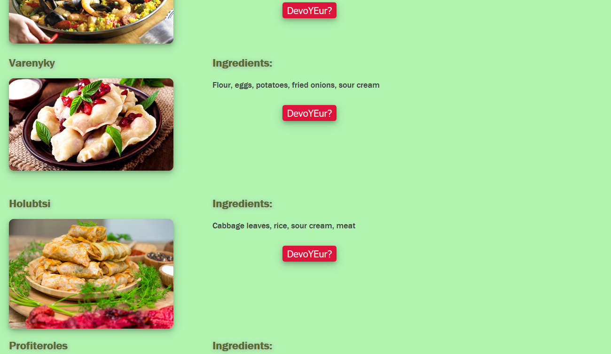
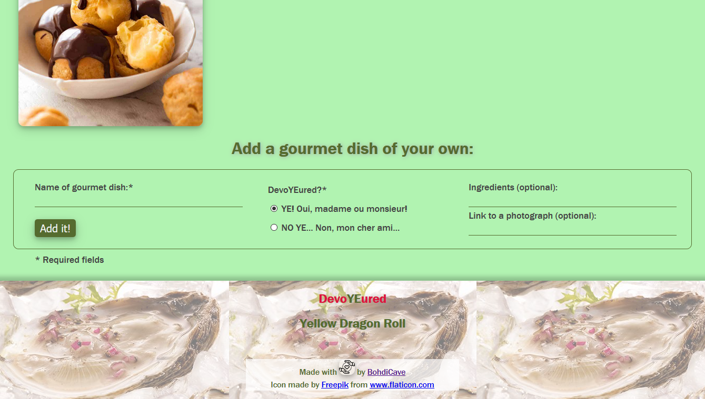

# ExpressiveDevoYEuring
An full-stack, MVC-modeled JS app for the gourmands utilizing node, express, and handlebars.

[](https://www.gnu.org/licenses/gpl-3.0)

## Technologies Used
* **GENERAL**: MVC architecture, Heroku cloud platform deployment
* **SERVER-side**: Node.js, Express.js, Handlebars.js, Custom-env.js, HTTP and API routing (GET/POST/PUT)
* **CLIENT-side**: jQuery (DOM access, event handling) with AJAX (GET/POST/PUT requests), CSS, HTML
* **DATABASE**: MySQL database, ORM database querying

## Jocular YE* Description
`* Yet Earnest`

This project focused on a simple yet `tittilating` one-page web app presenting the user, presumably a `gourmand` (a foodie, a `connoisseur` of all things delicious, perhaps even a `decadent` and a `hedonist` - but by no means a cynic or a nihilist), with a few choices of `gourmet dishes` to devoYEur (a `tantalizing` combination of internet `voyeurism` and visual - or, more accurately, `mental devouring`). 

In a very real sense, this app addresses the eternal existential question of humanity: 

`*To YE or not to YE?*`

Each dish is represented by:
* a name 
* a photograph (preferably aesthetically pleasing)
* a list of ingredients needed to prepare it
* and a current state of devoYEuring.

As long as the gourmand feels unsatiated with gazing at the photograph and reading the list of ingredients, while imagining the process of savouring every delicious bite, the dish may remain in abeyance, waiting to be "devoured". Once the gourmand has satisfied his virtual sense of taste sufficiently, the appropriate button "moves" the item name along with its photo into the "devoYEured" column on the right side of the page. `Once a dish has been devoYEured, the gourmand is free to continue pursuing his Epicurean pleasure seeking.` 

For those particularly creative and enthusiastic gourmands, there is an option to `contribute` to the general utility (whether marginal or total, I dare not say) by entering their `own dish suggestions`. At least a name and a state of being (already devoYEured or not) must be provided, though it's the ingredient list and the link to the photograph that, in fact, make up the `"meatiest"` (pun absolutely intended) portion of any such submission. (And so we must thank the gods of internet and search engineering - and no, not Google literally! - for allowing such ease of access to the necessary information). 

Just to provide for some `discipline and accountability`, as well as to avoid abandoning gourmands from across the world to their overpowering drive toward sensual pleasures, the list of already devoured dishes is stored in the footer of the page. Perhaps the `Calorie count` should be included as well, but that is something to consider in the `future`. 

## Features

* `Heroku`-deployed `Node.js` app with `MySQL` database functionality
* `MVC` modular architecture 
    * `Model` (M) utilizes `ORM` to construct database (D) queries and perform functions
    * `Views` (V) are set up using `Handlebars.js` package, including partials, to loop through and represent the database records
        * In addition, several static files for the frontend presentation (`CSS` code, `jQuery` code with `AJAX` requests, and the supporting image files) are set up in the `/public` directory (P)
    * `Controller` (C) uses `Express.js` as middleware
        * communications between the client and the server
        * communications with the database server
        * routing `HTTP` and `API` request traffic from the client and sending the appropriate `server` (S) response
        * `GET`, `POST`, and `PUT`/update functionality (DELETE was not relevant in this particular app)
* Directory structure: 
```
.______________________C________________________D_______________________M______________________ _ _
    │                  │                        │                       │               │
    config             controllers              db                      models          node_modules
    ├── connection.js  └── foods_controller.js  ├── schema.sql          └── food.js
    └── orm.js                                  ├── seeds_desserts.sql
                                                └── seeds.sql
_ _ ___________________P__________________________V_____________________S_______________ _ _ _ _ _ 
    │                  │                          │                     │               .gitignore
    package.json       public                     views                 server.js       .env
    │                  └── assets                 ├── layouts                            LICENSE
    package-lock.json      ├─ css                 │   └── main.handlebars                README     
                           │  └─ food_style.css   ├── partials                           index.html 
                           ├─ img                 │   └── food-block.handlebars            (mockup
                           │  ├─ care.png         └── index.handlebars                     for design 
                           │  ├─ screen1.png                                               and styles)
                           │  ├─ screen2.png
                           │  └─ screen3.png
                           └─ js
                              └─ foods.js
```

## Possible Future Directions
* Adding more detailed recipes of the dishes
* Providing some information (at the minimum, links) about the cuisines and cultures represented 
* Providing nutrition information
* Providing wine/beer/spirits pairing suggestions
* Restructuring the app away from dichotomous *YE or NO YE* logic toward affirmative YE! and MORE YE!, with additional options, aesthetic educational opportunities, and functionality.
* Contributing to elevating the level of overall cultural competence and cross-cultural understanding.

## Links

[Heroku-deployed app](https://serene-fortress-49055.herokuapp.com/)

[GitHub repository](https://github.com/BohdiCave/ExpressiveDevoYEuring)

## Screenshots






